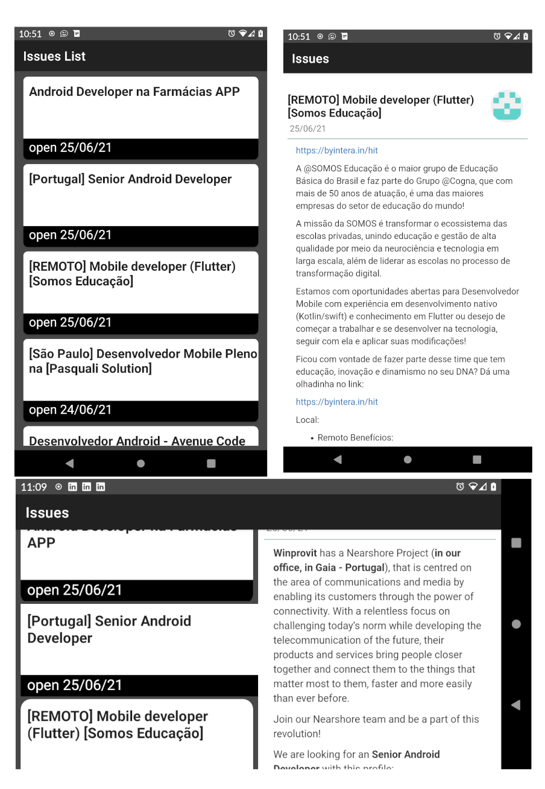

# GitIssues

## App Android em Kotlin para testar ferramentas como:
* Koin (injeção de dependencia)
* retrofit2 (estabelecer a comunicação HTTP com a API REST)
* Room (SQL Database)
* Glide (Stream de imagem)
* ViewModel LiveData (Gerenciamento de dados da Activity)

## Funcionalidades
* Carregar uma lista de issues de um repositorio do GiHub e exibir os detalhes ao tocar num item da lista
* Atualmente carregando a lista de issues da comunidade Android Dev BR (https://github.com/androiddevbr) que é dedicado a vagas para desenvolvedores android.

## Como rodar o projeto!
 * Abrir o projeto na IDE Android Studio, criar um emulador ou usar um dispositivo fisico e dar play na aplicação.
 
